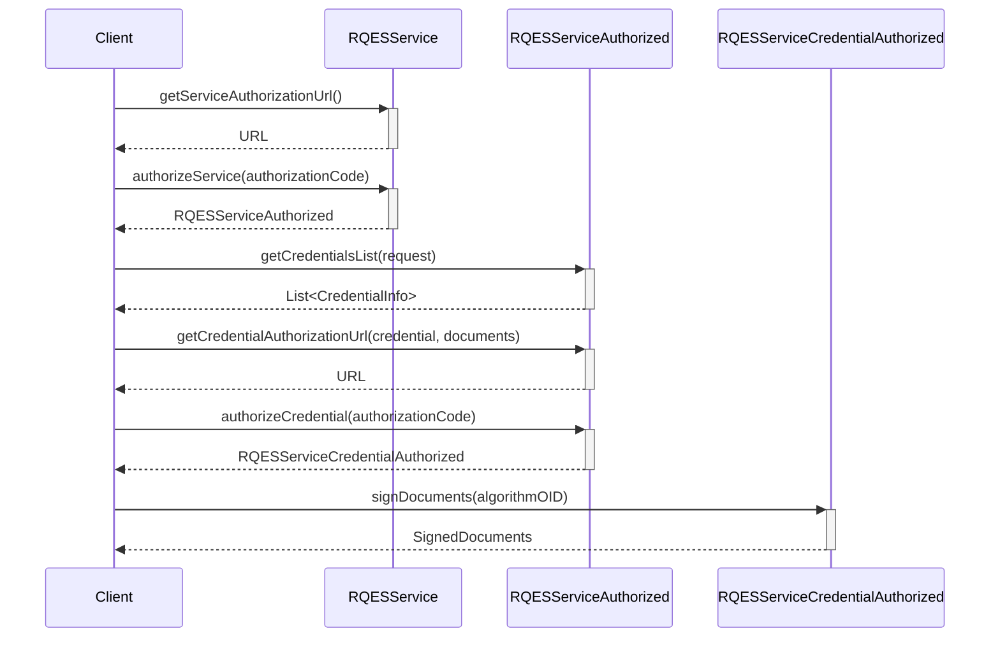

# EUDI Remote Qualified Electronic Signature (RQES) Kit library for iOS

:heavy_exclamation_mark: **Important!** Before you proceed, please read
the [EUDI Wallet Reference Implementation project description](https://github.com/eu-digital-identity-wallet/.github/blob/main/profile/reference-implementation.md)

## Overview

This module provides the core functionality for the EUDI Wallet, focusing on the Remote Qualified
Electronic Signature (RQES) service. The `RQESService` interface defines methods for obtaining
credential authorization URLs, authorizing credentials, and signing documents. It ensures secure and
compliant electronic signatures by interacting with authorized credentials and handling document
signing processes.

## Installation
To use RQES Kit, add the following dependency to your Package.swift:
```swift
dependencies: [
    .package(url: "https://github.com/niscy-eudiw/eudi-lib-ios-rqes-kit", exact: "0.6.4")
]
```

Then add the Eudi Wallet package to your target's dependencies:
```swift
dependencies: [
    .product(name: "RqesKit", package: "eudi-lib-ios-rqes-kit"),
]
```

## Document signing flow



## How to use

At first, construct an instance of the `RQESService` like shown below:

```swift
let cscClientConfig = CSCClientConfig(
    OAuth2Client: CSCClientConfig.OAuth2Client(
        clientId: "wallet-client",
        clientSecret: "somesecret2"
    ),
    authFlowRedirectionURI: "https://oauthdebugger.com/debug", rsspId: ""
)
var rqesService = await RQESService(
    clientConfig: cscClientConfig,
    defaultHashAlgorithmOID: .SHA256
)
```

To authorize the service, you need to get the authorization URL and open it in a browser. After the
user has authorized the service, the browser will be redirected to the `redirectUri`,
that
is configured in the `CSCClientConfig`, with a query parameter named `code` containing the
authorization code. You can then authorize the service by calling the `authorizeService` method:

```swift
let authorizationUrl = try await rqesService.getServiceAuthorizationUrl()

// Open the authorizationUrl in a browser
// After the user has authorized the service, the browser will be redirected to the redirectUri
// with a query parameter named "code" containing the authorization code

let authorizedService = try await rqesService.authorizeService(authorizationCode)
```

With the authorized service, you can list the available credentials by calling the `getCredentialsList`
method.

You can then select the credential you want to use, prepare the documents to sign, and get
the credential authorization URL by calling the `getCredentialAuthorizationUrl` method. After the
user has authorized the credential, you can authorize it by calling the `authorizeCredential`
method.

Finally, you can sign the documents by calling the `signDocuments` method.

```swift
let credentials = try await authorizedService.getCredentialsList()
// Use the credentials to select the one you want to use
// For example, select the first credential

let credential = credentials.first!
// Prepare the documents to sign
let documentURL = Bundle.main.url(forResource: "document", withExtension: "pdf")!
let unsignedDocuments = [Document(id: "Document to sign", fileURL: documentURL)]

// Get the credential authorization URL for the selected credential and documents
let credentialAuthorizationUrl = try await authorizedService.getCredentialAuthorizationUrl(
    credentialInfo: credential,
    documents: unsignedDocuments
)

// Use the credentialAuthorizationUrl to open a browser and let the user authorize the credential
// and get the authorization code from the redirect URI query parameter

// Authorize the credential
let authorizedCredential = try await authorizedService.authorizeCredential(authorizationCode)

// Sign the documents
let signAlgorithm = SigningAlgorithmOID.ECDSA_SHA256
let signedDocuments = try await authorizedCredential.signDocuments(signAlgorithmOID: signAlgorithm)
```

## Signing transaction logging (pending API change)

The pending change adds two optional parameters to the public initializers of
`RQESService`, `RQESServiceAuthorized`, and `RQESServiceCredentialAuthorized`:

| Parameter | Type | Default | Purpose |
| --- | --- | --- | --- |
| `transactionLogger` | `(any TransactionLogger)?` | `nil` | Receives signing transaction entries for storage by the host app. |
| `signingServiceName` | `MultiLangString?` | `nil` | Identifies the signing service in each entry's `interactingPartyName`. |

Both types come from `MdocDataModel18013`. 
Pass an actor conforming to `TransactionLogger` when creating the service. The actor
implements `func log(transaction: TransactionEntry) async throws` and stores or updates
entries by `transactionIdentifier` in the host app's chosen storage.

```swift
import RqesKit
import MdocDataModel18013

// transactionLogger is your app's actor conforming to TransactionLogger.
let service = await RQESService(
    clientConfig: cscClientConfig,
    transactionLogger: transactionLogger,
    signingServiceName: MultiLangString(lang: "en", content: "ACME Trust Services")
)
```

The service passes the logger and service name through `authorizeService()` and
`authorizeCredential()` automatically. If you construct either authorized service
directly, pass the same optional parameters to its initializer. Existing calls can
omit both parameters to keep logging disabled.

The logger receives one `TransactionEntry.signingSealing` per document when
`signDocuments()` succeeds (`.completed`) or throws (`.notCompleted`). Logging is
awaited before the method returns or rethrows the original signing error.
Entries contain the outcome, failure reason (`error.localizedDescription` on failure),
certificate serial number, document ID and filename, Base64 digest, and signed file
size in bytes when available. Each attempt has a shared `signingTransactionIdentifier`
and distinct transaction identifiers per document. The optional service name comes
from the host app. File contents and access tokens are not included.

Logging is disabled by default. Logger errors do not affect signing or prevent logging other documents. Failures before `signDocuments()` (including authorization failures) are not logged.

## Running tests

With Xcode and Ruby/Bundler installed, run:

```sh
bundle config set --local path .build/bundle
bundle install
bundle exec fastlane ios tests
```

The lane tests the `RqesKit` package on the iPhone Air simulator and writes reports
and an `.xcresult` bundle to `fastlane/test_output`. To use another installed simulator:

```sh
TEST_DEVICE="iPhone 17 Pro" bundle exec fastlane ios tests
```

## How to contribute

We welcome contributions to this project. To ensure that the process is smooth for everyone
involved, follow the guidelines found in [CONTRIBUTING.md](CONTRIBUTING.md).


### License details

Copyright (c) 2023 European Commission

Licensed under the Apache License, Version 2.0 (the "License");
you may not use this file except in compliance with the License.
You may obtain a copy of the License at

    http://www.apache.org/licenses/LICENSE-2.0

Unless required by applicable law or agreed to in writing, software
distributed under the License is distributed on an "AS IS" BASIS,
WITHOUT WARRANTIES OR CONDITIONS OF ANY KIND, either express or implied.
See the License for the specific language governing permissions and
limitations under the License.
